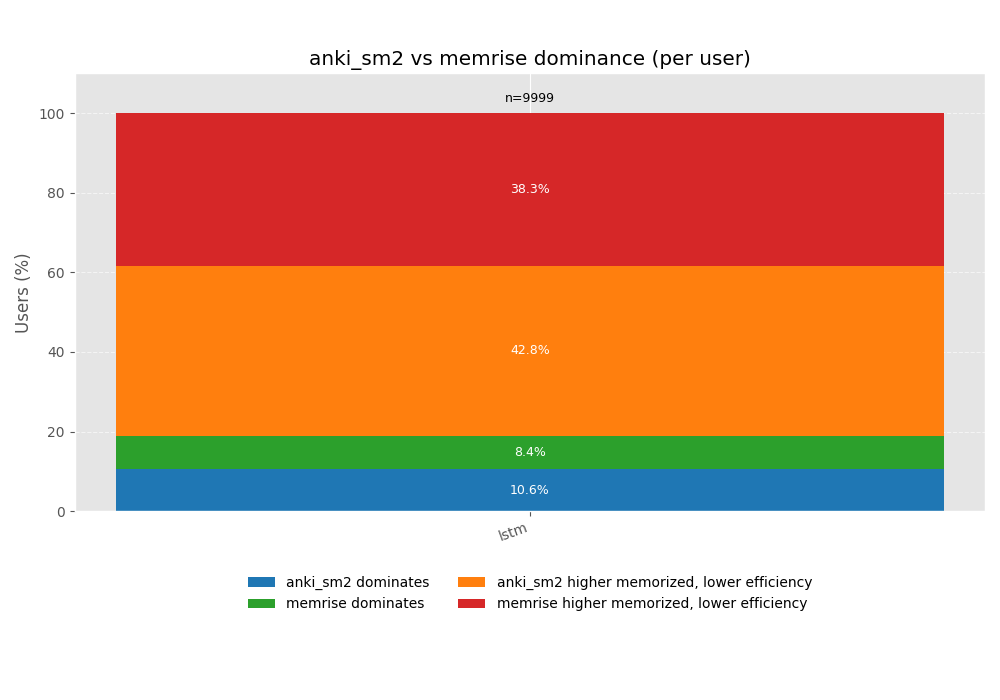
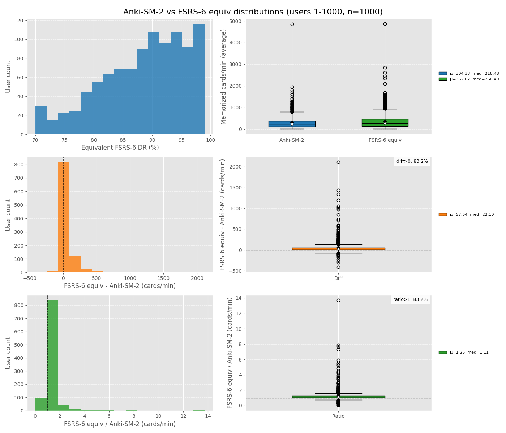
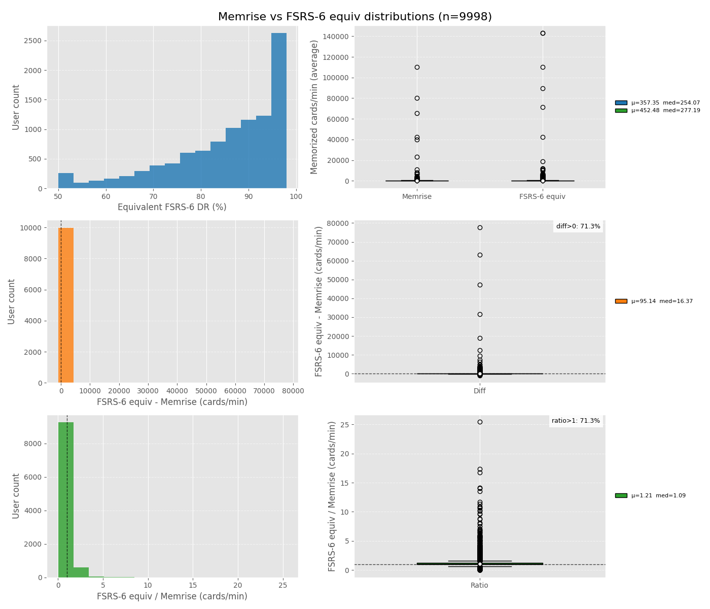

# Extensible Spaced-Repetition Simulator

This project is a small, dependency-light simulator inspired by [*What will a general simulator of spaced repetition consist of?*](https://l-m-sherlock.notion.site/What-will-a-general-simulator-of-spaced-repetition-consist-of-2c7c250163a1809684f3fe8cf8011a00) and mirrors the [Rust FSRS simulator](https://github.com/open-spaced-repetition/fsrs-rs/blob/main/src/simulation.rs) ideas in Python. It separates the simulator into four modules so you can stress-test schedulers against richer real-world assumptions, with both event-driven and vectorized engines.

## Quickstart
Install dependencies with uv, then run a quick simulation (no logs, just plots). Quickstart assumes [`../srs-benchmark`](https://github.com/open-spaced-repetition/srs-benchmark) and [`../Anki-button-usage`](https://github.com/open-spaced-repetition/Anki-button-usage) are available; see Requirements and data.

```bash
uv sync
uv run simulate.py --priority new-first --days 90 --no-log
```

Vectorized engine is the default. It does not emit per-event logs, so use `--engine event` if you need per-event records:

```bash
uv run simulate.py --engine event --priority new-first --days 90 --log-reviews
```

For faster GPU runs, use the vectorized engine:

```bash
uv run simulate.py --engine vectorized --torch-device cuda --no-log
uv run simulate.py --engine vectorized --env lstm --sched fsrs6 --no-log
```

## Requirements and data
- Python 3.13+ (matches `pyproject.toml`).
- Use `uv sync` to install dependencies. Torch is pulled from the uv indexes declared in `pyproject.toml` (CUDA builds on Windows/Linux, CPU builds on macOS).
- `srs-benchmark` repo is expected next to this repo at `../srs-benchmark` (override with `--srs-benchmark-root`). It provides FSRS/HLR/DASH weights in `result/*.jsonl` and LSTM weights in `weights/LSTM/<user_id>.pth`.
- Generate LSTM weights in the `srs-benchmark` repo by running:

```bash
uv run script.py --algo LSTM --weights
```

- `Anki-button-usage` repo is required by `simulate.py` and defaults to `../Anki-button-usage/button_usage.jsonl` (override with `--button-usage`). Pass `--user-id` to select the matching per-user row.
- SSP-MMC policies require precomputed policy files. Generate them in the sibling repo, then point `SSPMMCScheduler` at the outputs (see [`../SSP-MMC-FSRS`](https://github.com/open-spaced-repetition/SSP-MMC-FSRS)).

## CLI usage
Simulation logs store metadata and totals by default; add `--log-reviews` to include per-event logs (can be large). Daily time series are written to a sidecar CSV file with the same basename as the JSONL log. The vectorized engine ignores `--log-reviews` and only returns aggregate stats.

Common examples:

```bash
uv run simulate.py --days 30 --deck 500 --learn-limit 20 --review-limit 200 --cost-limit-minutes 60 --seed 7 --no-progress --no-log
uv run simulate.py --env fsrs3 --sched fsrs3 --desired-retention 0.85 --no-log
uv run simulate.py --env fsrs6 --sched hlr --desired-retention 0.8 --no-log
uv run simulate.py --sched fsrs6 --scheduler-priority high_difficulty --no-log
uv run simulate.py --sched fixed@7 --priority review-first --no-log
uv run simulate.py --log-dir logs/runs --days 180 --seed 123
uv run simulate.py --sched sspmmc --sspmmc-policy ../SSP-MMC-FSRS/outputs/policies/<policy>.json --no-log
```

Flag notes:
- `--no-plot` and `--no-progress` disable the Matplotlib dashboard and progress bar.
- `--log-dir` controls where JSONL logs and daily CSVs are written.
- `--button-usage` points at a button-usage JSONL file to override default costs and rating probabilities.
- `--benchmark-result` and `--benchmark-partition` override which `srs-benchmark` result rows are loaded.
- `--fuzz` applies Anki-style interval fuzzing to scheduler outputs.

FSRS6 priority modes: `low_retrievability`, `high_retrievability`, `low_difficulty`, `high_difficulty`.

Sanity checks: `tests/sanity_lstm_forward_calls.py` runs a quick vectorized LSTM simulation and prints the number of LSTM forward calls to confirm it scales with days, not reviews.

## Experiments
Retention sweep + Pareto (compare environments, optional SSP-MMC policies):

```bash
uv run experiments/retention_sweep/run_sweep.py --env fsrs6,lstm --sched fsrs6
uv run experiments/retention_sweep/run_sweep.py --env fsrs6,lstm --sched sspmmc
uv run experiments/retention_sweep/run_sweep.py --env fsrs6,lstm --sched fsrs6,sspmmc
uv run experiments/retention_sweep/build_pareto.py --env fsrs6,lstm --sched fsrs6,sspmmc
```

By default, SSP-MMC policies are loaded from `../SSP-MMC-FSRS/outputs/policies/user_<id>`. Override with `--sspmmc-policy-dir` or `--sspmmc-policies`. Use `--sched` to compare DR sweeps across schedulers; include `sspmmc` to add policy curves. For fixed intervals, pass `fixed@<days>` in `--sched`. Retention sweep logs default to `logs/retention_sweep/user_<id>`. `build_pareto.py` writes results JSON to `logs/retention_sweep/<config>/` and plots to `experiments/retention_sweep/plots/<config>/`, where `<config>` encodes `--short-term`, `--fuzz`, `--engine`, and compare flags; per-user outputs are disambiguated with `_user_<id>` in the filename. `build_pareto.py` annotates points by default; pass `--hide-labels` to disable, `--fuzz on/off` to filter logs, or `--compare-fuzz` to overlay fuzz on/off curves. The retention sweep defaults to the vectorized engine; pass `--engine event` if you need per-event logs.

Short-term scheduling (event or vectorized engines):

```bash
uv run simulate.py --engine event --env lstm --sched lstm --short-term-source steps --learning-steps 1,10 --relearning-steps 10
```

To explicitly disable learning/relearning steps while using `--short-term-source steps`, pass empty strings:

```bash
uv run simulate.py --engine event --env lstm --sched lstm --short-term-source steps --learning-steps "" --relearning-steps ""
```

Scheduler-driven short-term (LSTM only, no steps):

```bash
uv run simulate.py --engine event --env lstm --sched lstm --short-term-source sched
```

Use `--short-term-loops-limit <N>` to cap short-term loops per user per day in event/vectorized/batched runs; remaining short-term cards carry over to the next day.

When short-term scheduling is enabled, benchmark weights are loaded from `*-short-secs` result files, and LSTM weights are loaded from `weights/LSTM-short-secs` in the `srs-benchmark` repo (override via `--benchmark-result` if needed).

Additional retention sweep helpers:

```bash
uv run experiments/retention_sweep/run_sweep_users.py --start-user 1 --end-user 10 --env fsrs6,lstm --sched fsrs6,anki_sm2,memrise --max-parallel 4
uv run experiments/retention_sweep/run_sweep_users_batched.py --start-user 1 --end-user 200 --env lstm --sched fsrs6,anki_sm2,memrise --batch-size 100
uv run experiments/retention_sweep/build_pareto_users.py --start-user 1 --end-user 10 --env fsrs6,lstm --sched fsrs6,sspmmc
uv run experiments/retention_sweep/aggregate_users.py --env lstm --sched fsrs6,anki_sm2,memrise
uv run experiments/retention_sweep/dominance_sm2_memrise.py --env lstm
```

- `run_sweep_users.py` fans out `run_sweep.py` across a user-id range and supports `--max-parallel`, `--cuda-devices` (round-robin per worker), plus MPS env passthrough; `--max-parallel` only delivers speedups when GPU Multi-Process Service (MPS) is enabled on the host. In parallel it shows an overall work bar, a user bar, and per-worker bars (disable with `--child-progress off`, and use `--show-commands on` if you need the raw subprocess commands).
- `run_sweep_users_batched.py` runs LSTM/FSRS6 retention sweeps in batched vectorized mode; use `--batch-size` to control how many users are simulated in parallel and `--cuda-devices` to distribute batches across multiple GPUs. Short-term steps are supported via `--short-term-source steps`, and LSTM sched-based short-term is supported via `--short-term-source sched`.
- `SRS_LSTM_MAX_BATCH` defaults to 20000, which typically needs ~12GB of GPU memory; it is best paired with `--batch-size 1000` for throughput.
- `build_pareto_users.py` fans out `build_pareto.py` across a user-id range.
- `aggregate_users.py` aggregates per-user retention_sweep logs into summary JSON and plots FSRS-6 equivalent distributions vs Anki-SM-2/Memrise.
- `dominance_sm2_memrise.py` reports per-user dominance rates between Anki-SM-2 and Memrise and saves a stacked bar chart.
- Note: very high desired retention targets (e.g., `--end-retention 0.99` for FSRS6 sweeps) can dramatically increase GPU memory usage; reduce batch size or cap retention if you hit OOM.
- Retention range flags use `--start-retention/--end-retention` across the sweep, aggregate, and pareto tools.
- To pass retention sweep overrides (e.g., `--start-retention/--end-retention/--step`, now 0-1 floats) to `run_sweep.py`, add them after `--` when invoking `run_sweep_users.py`.

## Engine support matrix

Legend: ✓ supported, — not supported.

Event engine:

| env \\ sched | fsrs6 | fsrs3 | hlr | dash | lstm | fixed | anki_sm2 | memrise | sspmmc |
| --- | --- | --- | --- | --- | --- | --- | --- | --- | --- |
| lstm | ✓ | ✓ | ✓ | ✓ | ✓ | ✓ | ✓ | ✓ | ✓ |
| fsrs6 | ✓ | ✓ | ✓ | ✓ | ✓ | ✓ | ✓ | ✓ | ✓ |
| fsrs3 | ✓ | ✓ | ✓ | ✓ | ✓ | ✓ | ✓ | ✓ | ✓ |
| hlr | ✓ | ✓ | ✓ | ✓ | ✓ | ✓ | ✓ | ✓ | ✓ |
| dash | ✓ | ✓ | ✓ | ✓ | ✓ | ✓ | ✓ | ✓ | ✓ |

Vectorized engine:

| env \\ sched | fsrs6 | fsrs3 | hlr | dash | lstm | fixed | anki_sm2 | memrise | sspmmc |
| --- | --- | --- | --- | --- | --- | --- | --- | --- | --- |
| lstm | ✓ | ✓ | ✓ | — | ✓ | ✓ | ✓ | ✓ | ✓ |
| fsrs6 | ✓ | ✓ | ✓ | — | ✓ | ✓ | ✓ | ✓ | ✓ |

Batched (multi-user vectorized in `run_sweep_users_batched.py`):

| env \\ sched | fsrs6 | fsrs3 | lstm | anki_sm2 | memrise | fixed |
| --- | --- | --- | --- | --- | --- | --- |
| lstm | ✓ | ✓ | ✓ | ✓ | ✓ | ✓ |
| fsrs6 | ✓ | ✓ | ✓ | ✓ | ✓ | ✓ |

Notes:
- Event engine is the reference implementation and supports all scheduler/environment combinations, even if some pairings are not meaningful.
- Vectorized engine supports only LSTM and FSRS6 environments and does not implement DASHScheduler.
- Batched mode is intended for retention sweeps; it is vectorized-only and currently limited to the schedulers listed above.

## Evaluation
`experiments/retention_sweep/aggregate_users.py` compares scheduler efficiency by aggregating retention_sweep logs across users for each environment, scheduler, and target setting (desired retention or fixed interval) and restricting to the intersection of user IDs so each config is compared on the same users.

Metrics and outputs:
- Memorized cards (average, all days): average number of memorized cards across the full simulation horizon.
- Study minutes per day (average): average study time per day from the logs.
- Memorized cards per minute (average): memorized cards divided by study minutes, used as the primary efficiency metric.
- Plots: for baseline schedulers (default Anki-SM-2 and Memrise), it computes each user's FSRS-6 equivalent DR by interpolating FSRS-6 points to match the baseline memorized cards (average, all days), then compares memorized cards per minute (average) distributions along with per-user differences and ratios.
- Per-user Pareto frontier comparison: `build_pareto_users.py` saves a Pareto frontier plot per user (filename suffixed with `_user_<id>`) into a shared config-specific plot directory, overlaying environments and schedulers to show the efficiency frontier in terms of memorized cards (average, all days) vs memorized cards per minute (average).
- Axes under default retention_sweep settings (1825 days, deck 10,000, learn limit 10/day, review limit 9,999/day, cost limit 720 minutes/day, review-first, seed 42, vectorized engine): the X axis "Memorized cards (average, all days)" is the expected number of cards remembered per day averaged over the whole run (sum of predicted retrievability across learned cards), and the Y axis "Memorized cards per minute (average)" is computed by taking that average memorized-cards-per-day value and dividing it by the average study minutes per day from the cost model, so it can be read as "how many cards you effectively keep remembered for each minute of study" over the whole run (higher = more efficient use of time, lower = more time spent per remembered card).

## Retention sweep comparisons (lstm)

_All figures below use `--short-term off` in `aggregate_users.py`._

**SM2 vs Memrise dominance**


_Caption: Per-user dominance outcomes between Anki-SM-2 and Memrise (dominates vs tradeoff)._

**FSRS6 equivalence vs Anki-SM-2**


_Caption: FSRS-6 interpolated to match Anki-SM-2 memorized-average per user; compares memorized-per-minute distributions and deltas. (n=9999; superiority=86.5%; mean ratio=1.382; median ratio=1.134 (IQR 1.048-1.319); mean DR=0.879; median DR=0.896)._

**FSRS6 equivalence vs Memrise**


_Caption: FSRS-6 interpolated to match Memrise memorized-average per user; compares memorized-per-minute distributions and deltas. (n=9999; superiority=85.2%; mean ratio=1.342; median ratio=1.172 (IQR 1.066-1.352); mean DR=0.860; median DR=0.886)._

## Benchmarks
Performance baselines live under `benches/`. See `benches/README.md` for details.

Run the default suite:

```bash
uv run python benches/run_bench.py --srs-benchmark-root ../srs-benchmark
```

Run a single scenario:

```bash
uv run python benches/run_bench.py --scenario event_lstm_lstm --srs-benchmark-root ../srs-benchmark
```

## Key concepts
- **MemoryModel / Environment**: (`simulator.core.MemoryModel`) governs how recall probability and memory state evolve. Implementations live under `simulator/models`.
- **BehaviorModel / User**: (`simulator.core.BehaviorModel`) turns hidden retrievability into observed ratings, can skip days, and sets the first rating.
- **CostModel / Workload**: (`simulator.core.CostModel`) converts each review into a dynamic time cost (e.g. longer latency when R is low).
- **Scheduler** (`simulator.core.Scheduler`): the agent under test. It only receives a `CardView` projection (history, due date, prior intervals) and returns the next interval plus its internal state.
- **simulate** (`simulator.core.simulate`): a day-stepped loop that wires all four components together.
- **simulate** (`simulator.vectorized.simulate`): a torch/GPU vectorized engine for FSRS6 or LSTM environments with FSRS6/FSRS3/HLR/fixed/Memrise/Anki SM-2/SSPMMC/LSTM schedulers. It returns aggregate stats without per-event logs and accepts a `device` override.

## Architecture and control flow
The simulator follows an environment-agent loop where each module owns a distinct responsibility and communicates through lightweight data structures.

### Data model
| Type | Purpose |
| --- | --- |
| `Card` | Internal state tracked by the simulator (id, due, lapses, memory/scheduler state, metadata). |
| `CardView` | Scheduler/behavior-visible projection of a card. Includes history but hides the environment's ground-truth state. |
| `ReviewLog` | `(rating, elapsed, day)` tuples appended to `Card.history` and used for logging/analysis. |
| `SimulationStats` | Time series counters plus a chronological list of `Event` records (`day`, `action`, `card_id`, `rating`, `retrievability`, `cost`, `interval`, `due`). |

### Event loop
1. **Initialize deck** - create `Card` objects, seed future queue with due dates, and set up per-day counters.
2. **Daily setup** - each simulated day:
   - Call `behavior.start_day(day, rng)` to reset attendance/limit tracking.
   - Move cards whose `due <= day` from the future queue into the ready heap. Each ready entry stores `(scheduler.review_priority(view, day), tie_breaker, card_id)` so the scheduler can hint which review should run first (e.g., lowest retrievability).
3. **Behavior-driven actions** - repeatedly ask `behavior.choose_action(day, next_review_view, next_new_view, rng)`:
   - `next_review_view` is the highest-priority ready card, `next_new_view` is a placeholder for the next unseen card.
   - Behavior may return `Action.REVIEW`, `Action.LEARN`, or `None` (stop for the day). It enforces daily limits (new/review counts, cost ceiling) and implements heuristics such as new-first vs review-first.
4. **Learning path** - when choosing `Action.LEARN`:
   - Behavior picks an initial rating via `initial_rating`.
   - `MemoryModel.init_card` sets the ground-truth stability/difficulty.
   - `Scheduler.init_card` computes the first interval and scheduler state.
   - `CostModel.learning_cost` returns task time; the simulator updates stats, records a "new" event, and schedules the next review by pushing `(due, priority, id)` back to the future queue.
5. **Review path** - when choosing `Action.REVIEW`:
   - Compute elapsed days and call `MemoryModel.predict_retention` for true retrievability.
   - Behavior samples a rating via `review_rating`; if it returns `None` the user skipped the rest of the day and the card is deferred.
   - Otherwise update ground-truth (`MemoryModel.update_card`), ask the scheduler for the next interval (`schedule`), compute review cost, update stats, and log a "review" event.
6. **Deferral** - once behavior stops or limits are reached, any remaining ready reviews are deferred by setting `card.due = day + 1` and re-queuing. This ensures they appear first on the next day but retain scheduler-provided priority hints.
7. **Post-processing** - after all days, compute daily retention (`1 - lapses/reviews`) and return `SimulationStats`.

### Priority plumbing
- **Scheduler hint** - `Scheduler.review_priority(view, day)` returns a tuple (default `(due, id)`). FSRS schedulers override it to sort by predicted retrievability or difficulty. The simulator stores the hint in `Card.metadata["scheduler_priority"]`.
- **Behavior ordering** - `BehaviorModel.priority_key(view)` prepends its own policy (e.g., review-first) and consumes the scheduler hint so user strategies can favor reviews or new cards without losing the scheduler's ordering inside each bucket.

This separation lets you benchmark schedulers against arbitrary memory models and user behaviors while keeping transparency about where each decision is made.

## Provided models
CLI environments are `fsrs6`, `fsrs3`, and `lstm`; HLR/DASH models are available for custom code but are not wired into the `simulate.py` CLI.
- `FSRS6Model`: FSRS v6-style environment (21 params loaded from `srs-benchmark` for the selected user).
- `FSRS3Model`: FSRS v3-style environment (13 params loaded from `srs-benchmark`).
- `HLRModel`: half-life regression with three weights loaded from `srs-benchmark`.
- `DASHModel`: stateless logistic model with placeholder features and nine weights loaded from `srs-benchmark`.
- `LSTMModel`: neural forgetting-curve predictor inspired by the srs-benchmark LSTM (requires PyTorch and `--user-id` weights; runs on CUDA when available, otherwise CPU; expects day-based intervals like the original `delta_t` feature).

## Provided schedulers
- `FSRS6Scheduler` / `FSRSScheduler`: FSRS v6-style state; loads weights from `srs-benchmark` for the selected user.
- `FSRS3Scheduler`: FSRS v3-style scheduler with weights from `srs-benchmark`.
- `HLRScheduler`: schedules using half-life regression weights from `srs-benchmark`.
- `DASHScheduler`: logistic retention solver that mirrors the DASH model and uses weights from `srs-benchmark`.
- `SSPMMCScheduler`: loads precomputed SSP-MMC-FSRS policies (JSON + `.npz`) and maintains its own FSRS6 state so it can target optimal retention under any environment.
- `FixedIntervalScheduler`: stateless fixed-interval baseline (`--sched fixed@<days>`).
- `AnkiSM2Scheduler`: Anki SM-2-style ease scheduler (`--sched anki_sm2`).
- `MemriseScheduler`: Memrise sequence scheduler (`--sched memrise`).
- `LSTMScheduler`: LSTM curve-fit scheduler that targets a desired retention from review history.

## Provided behavior and cost models
- `StochasticBehavior`: configurable attendance probability, lazy-good bias, and daily limits (max new/reviews/cost).
- `StatefulCostModel`: combines FSRS state rating costs (learning/review/relearning) with a latency penalty that grows as retrievability drops.

## Extend
- Add a new memory model: subclass `MemoryModel`, implement `init_card`, `predict_retention`, and `update_card`.
- Add a new behavior model: subclass `BehaviorModel`, implement `initial_rating` and `review_rating`.
- Add a new cost model: subclass `CostModel`, implement `review_cost`.
- Add a new scheduler: subclass `Scheduler`, implement `init_card` and `schedule` that operate on `CardView`.
- Swap components in `simulate` to study how scheduler policies perform under different ground-truth models, user behaviors, and workload assumptions.

## Acknowledgements
- [1DWalker](https://github.com/1DWalker) provided acceleration advice.
- [Asuka Minato](https://github.com/asukaminato0721) provided GPU servers.
- [Expertium](https://github.com/Expertium) provided visualization advice.
- [Jarrett Ye](https://github.com/L-M-Sherlock) supervised Codex on this project.
- [Luc Mcgrady](https://github.com/Luc-Mcgrady) inspired the event-driven engine.
