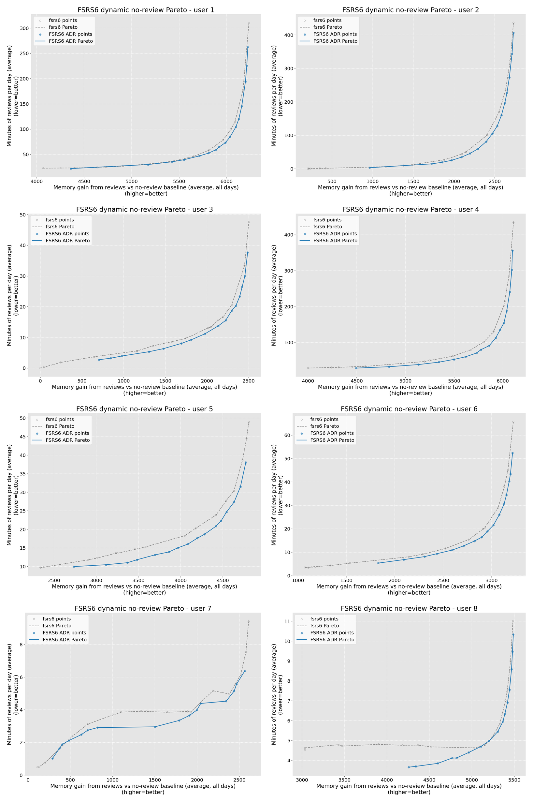
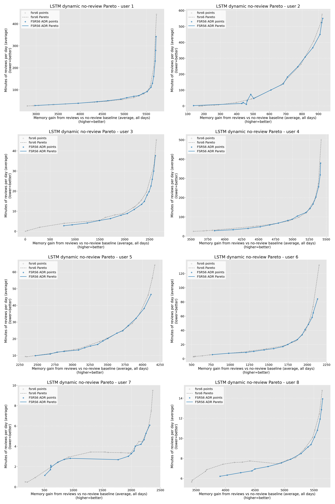

# Dynamic No-Review Baseline Sensitivity

Date: 2026-07-16

## Question

Measure how much memory later reviews add beyond a matched counterfactual in
which every card receives the same first exposure but no subsequent review.
This replaces the static assumption that `P(first rating > 1)` remains
unchanged throughout the five-year simulation.

## Definition

For user `u`, environment `e`, first-rating distribution `q_u(r)`, and card age
`a`, the no-review retention kernel is:

```text
K_u,e(a) = sum_r q_u(r) * R_e(init_card(r), a)
```

Each evaluated strategy keeps its actual daily first-exposure counts `n_t`.
At the start of day `d`, its matched no-review memory is:

```text
no_review_memory[d]
  = unlearned[d] * P(first rating > 1)
  + sum_(t < d) n_t * K(d - t)
```

The review contribution is therefore:

```text
review_memory_gain[d]
  = daily_memorized[d]
  - sum_(t < d) n_t * K(d - t)
```

`review_time_average` includes later reviews and short-term review loops but
excludes first-exposure cost. The incremental Pareto view uses
`review_memory_gain_average` against `review_time_average`.

## Run

The run uses users 1-8, FSRS6 and LSTM environments, 1,825 days, a 10,000-card
deck, learn limit 10, review limit 9,999, new-first priority, short-term off,
fuzz off, review Markov transition off, and seed 43. It compares 16 per-user
FSRS6 baseline desired-retention points against 16 policies from
`fsrs6_adr_portfolio_users_1_8_pop16_v1_markov_off`.

Run id: `dynamic_no_review_adr_first8_v1`.

## Counterfactual Baselines

Within each user and environment, all 32 scheduler points produced the same
rounded `no_review_memorized_average`, confirming that the counterfactual is
matched on first-exposure timing rather than scheduler review behavior.

| user | first-rating recall prior | FSRS6 no-review memory | LSTM no-review memory |
| ---: | ---: | ---: | ---: |
| 1 | 0.9245 | 3,474 | 3,881 |
| 2 | 0.8647 | 6,713 | 8,289 |
| 3 | 0.9080 | 7,149 | 6,973 |
| 4 | 0.6359 | 2,788 | 3,433 |
| 5 | 0.5064 | 3,722 | 4,196 |
| 6 | 0.6274 | 5,664 | 6,509 |
| 7 | 0.9043 | 7,063 | 7,258 |
| 8 | 0.3967 | 2,765 | 2,505 |

All 512 evaluated points have positive review memory gain. The minimum rounded
gain is 1 card in FSRS6 and 3 cards in LSTM. This removes the negative-gain
artifact produced by the static, non-decaying prior baseline.

## Pareto Results

The control uses `memorized_average` against total `time_average`. The dynamic
view uses review memory gain against review-only time. All comparisons report
FSRS6 ADR relative to the FSRS6 scheduler frontier.

| env | axes | HV delta / baseline | relative same-budget memory lift | relative same-target time saved |
| --- | --- | ---: | ---: | ---: |
| FSRS6 | control | 3.093% | 1.333% | 11.496% |
| FSRS6 | review gain / review time | 3.232% | 3.275% | 13.459% |
| LSTM | control | 1.577% | 0.782% | 5.153% |
| LSTM | review gain / review time | 1.793% | 2.143% | 6.452% |

The conclusion does not reverse. Removing first-exposure memory and cost makes
the ADR advantage larger in both environments. The relative same-review-budget
memory lift increases by 1.942 percentage points in FSRS6 and 1.361 percentage
points in LSTM.

Unweighted policy-point average review gains are 3,195.9 cards for FSRS6 versus
3,613.3 for FSRS6 ADR in the FSRS6 environment, and 2,723.7 versus 3,019.8 in
the LSTM environment.

### FSRS6 Frontiers

Gray dashed lines show the FSRS6 frontier; blue lines show the FSRS6 ADR
frontier. The x-axis is `review_memory_gain_average` and the y-axis is
`review_time_average`.



### LSTM Frontiers



## GPU Monitor

Both sweeps ran on an NVIDIA GeForce RTX 4090 D with expandable CUDA allocator
segments enabled.

| env | lane cap | wall time | peak GPU memory | peak utilization | peak summed shared memory | spill |
| --- | ---: | ---: | ---: | ---: | ---: | --- |
| FSRS6 | 8,192 | 26.58 s | 2,484 MiB | 38% | 214,429,696 bytes | false |
| LSTM | 1,024 | 45.61 s | 4,302 MiB | 65% | 212,881,408 bytes | false |

Neither run approached the 1 GiB shared-memory spill threshold.

## Interpretation

This counterfactual answers the incremental question more directly than the
static prior metric: it includes the memory and time from one initial exposure
on the same dates, then attributes only later memory differences and costs to
reviews. The remaining approximation is that first ratings are integrated in
expectation from the user distribution rather than replayed card by card. With
10,000 cards per lane this removes sampling noise while preserving the user's
rating mix and environment-specific forgetting dynamics.
