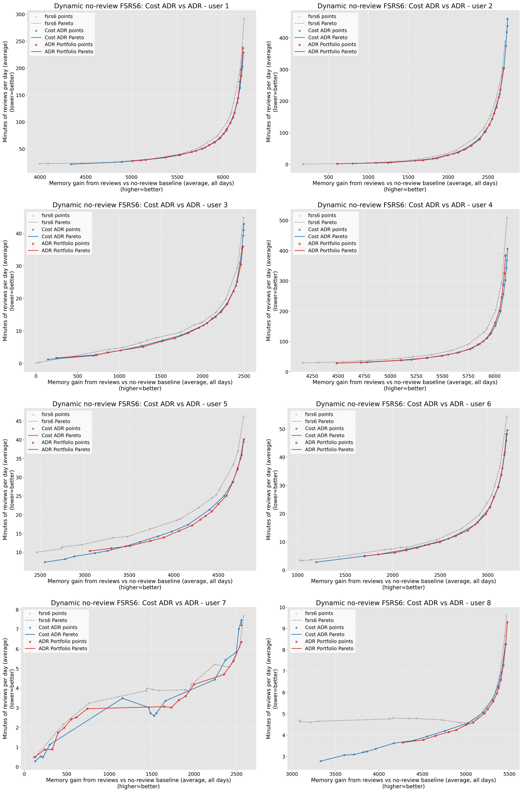
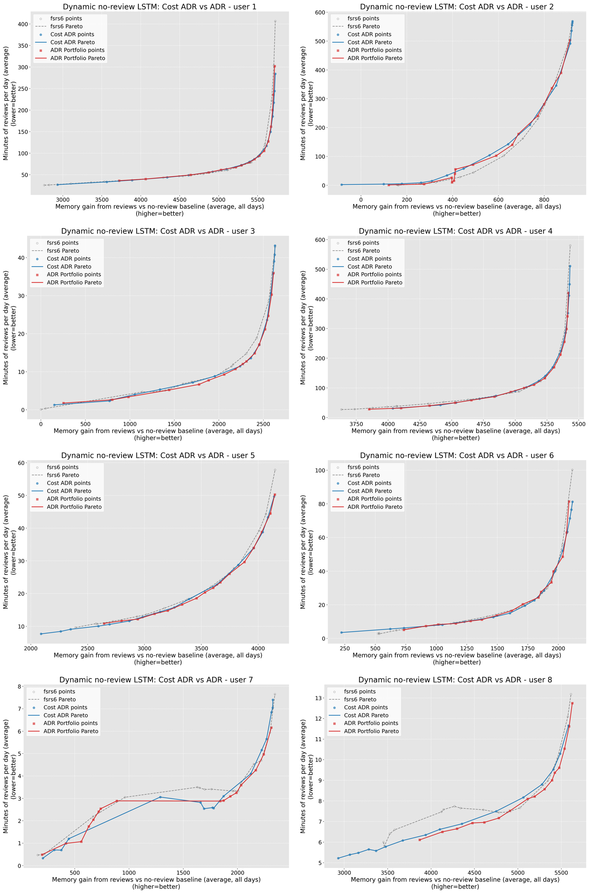

# Dynamic No-Review Cost ADR 1-128 Pareto Sensitivity

Date: 2026-07-16

Analysis summaries:

- FSRS6: `artifacts/rl_scheduler/dynamic_no_review_cost_adr_128_v1/fsrs6/analysis_review_gain.json`
- LSTM: `artifacts/rl_scheduler/dynamic_no_review_cost_adr_128_v1/lstm/analysis_review_gain.json`

## Question

Does replacing total memorized cards and total study time with memory added by
later reviews and review-only time change the 128-user Cost ADR conclusion?

The dynamic counterfactual follows the definition in
`2026-07-16-dynamic_no_review_baseline_sensitivity.md`: every strategy keeps its
actual first-exposure dates, while the no-review branch applies
environment-specific forgetting after that first exposure. The Pareto axes are
`review_memory_gain_average` and `review_time_average`.

## Executive Answer

No conclusion reverses.

On FSRS6, Cost ADR remains ahead of the matched pop16 ADR Portfolio. Its dynamic
HV delta is 1,397,642 versus 1,239,528 for ADR, a Cost-minus-ADR advantage of
+158,114 HV. Cost ADR also has +14.1 cards of same-review-budget memory-lift AUC
and +0.14 minutes of same-target review-time-saved AUC over ADR. The per-user HV
comparison favors Cost ADR on 94/128 users.

On LSTM, Cost ADR remains behind ADR. Its dynamic HV delta is 604,342 versus
682,408 for ADR, a Cost-minus-ADR deficit of -78,066 HV. It trails by 8.6 cards
of same-review-budget memory-lift AUC and 1.29 minutes of same-target
review-time-saved AUC. Cost ADR wins only 44/128 per-user HV comparisons.

Removing first-exposure memory and cost narrows the FSRS6 HV advantage from
+206,199 to +158,114 and widens the LSTM deficit from -56,869 to -78,066. The
practical status is unchanged: the 15-parameter Cost ADR policy is an
FSRS6-native candidate, not a cross-model replacement for ADR Portfolio.

## Run

Run id: `dynamic_no_review_cost_adr_128_v1`.

The run covers users 1-128, FSRS6 and LSTM environments, 1,825 days, a
10,000-card deck, learn limit 10, review limit 9,999, new-first priority,
short-term off, fuzz off, review Markov transition off, and seed 43.

Each user/environment has 48 points:

| scheduler | points per user | source |
| --- | ---: | --- |
| FSRS6 | 16 | `artifacts/rl_scheduler/baseline_dr_selection/fsrs6_users_1_128_16dr_pop16_gen5.json` |
| ADR Portfolio | 16 | `artifacts/rl_scheduler/fsrs6_adr_portfolio_users_1_128_pop16/fsrs6_adr_portfolio_users_1_128_pop16_v1_markov_off` |
| Cost ADR 15p | 16 | `artifacts/rl_scheduler/fsrs6_cost_adr_rethead_intervalinit_wide_nopre_users_1_128/fsrs6_cost_adr_rethead_intervalinit_wide_nopre_users_1_128_pop16_gen20_v1_markov_off` |

The two sweeps produced 12,288 JSONL logs: 2,048 for every
environment/scheduler pair. Existing policy artifacts were reused; no training
was rerun because the new fields change evaluation, not the training objective.

## Dynamic Pareto Results

HV delta is computed against each user's matched FSRS6 baseline frontier.
Memory lift uses a common review-time budget interval. Time saved uses a common
review-memory-gain target interval. Relative AUC values are user-simple
averages.

| env | scheduler | HV delta sum | HV delta / baseline | frontier points | memory-lift AUC | relative memory lift | budget span | time-saved AUC | relative time saved | target span |
| --- | --- | ---: | ---: | ---: | ---: | ---: | ---: | ---: | ---: | ---: |
| FSRS6 | ADR Portfolio | 1,239,528 | +3.786% | 2,034 | 107.8 | +3.494% | 80.133% | 4.04 | +11.325% | 83.240% |
| FSRS6 | Cost ADR 15p | 1,397,642 | +4.269% | 1,952 | 121.9 | +4.351% | 83.699% | 4.18 | +13.574% | 90.742% |
| FSRS6 | Cost ADR - ADR | +158,114 | +0.483 pp | -82 | +14.1 | +0.856 pp | +3.565 pp | +0.14 | +2.249 pp | +7.502 pp |
| LSTM | ADR Portfolio | 682,408 | +1.832% | 1,905 | 26.0 | +0.953% | 72.537% | 2.16 | +5.791% | 84.110% |
| LSTM | Cost ADR 15p | 604,342 | +1.623% | 1,890 | 17.4 | +0.489% | 78.337% | 0.87 | +3.025% | 92.897% |
| LSTM | Cost ADR - ADR | -78,066 | -0.210 pp | -15 | -8.6 | -0.464 pp | +5.800 pp | -1.29 | -2.767 pp | +8.787 pp |

Cost ADR covers wider review-budget and memory-target spans in both
environments. Coverage does not offset its lower LSTM HV and AUC values.

## Sensitivity To Axis Choice

The control rows use `memorized_average` against `time_average` from the same
new logs. The dynamic rows use review memory gain against review-only time.

| env | axes | Cost-minus-ADR HV | HV ratio gap | Cost wins | median per-user HV gap | memory-lift gap | relative memory gap | time-saved gap | relative time gap |
| --- | --- | ---: | ---: | ---: | ---: | ---: | ---: | ---: | ---: |
| FSRS6 | control | +206,199 | +0.599 pp | 97/128 | +696 | +14.0 | +0.245 pp | +0.14 | +1.701 pp |
| FSRS6 | review gain / review time | +158,114 | +0.483 pp | 94/128 | +558 | +14.1 | +0.856 pp | +0.14 | +2.249 pp |
| LSTM | control | -56,869 | -0.142 pp | 49/128 | -430 | -8.3 | -0.097 pp | -1.28 | -2.235 pp |
| LSTM | review gain / review time | -78,066 | -0.210 pp | 44/128 | -531 | -8.6 | -0.464 pp | -1.29 | -2.767 pp |

The dynamic axes make incremental relative AUC differences larger because the
shared first-exposure memory and cost no longer dominate the denominator. They
do not rescue LSTM transfer; they make the cross-model weakness clearer.

## Counterfactual Checks

For every user/environment, all 48 points have exactly the same rounded
`no_review_memorized_average`. This confirms that scheduler review behavior does
not leak into the counterfactual.

| env | users | mean no-review memory | median | min | max |
| --- | ---: | ---: | ---: | ---: | ---: |
| FSRS6 | 128 | 5,143.2 | 5,310.5 | 1,552 | 8,338 |
| LSTM | 128 | 5,519.4 | 5,435.0 | 1,888 | 9,729 |

Six of 12,288 points have negative rounded review memory gain:

| env | user | scheduler | point | review gain | review time |
| --- | ---: | --- | --- | ---: | ---: |
| FSRS6 | 127 | FSRS6 | DR 0.520 | -2 | 0.00 |
| LSTM | 98 | FSRS6 | DR 0.508 | -1 | 0.00 |
| LSTM | 110 | FSRS6 | DR 0.512 | -1 | 0.00 |
| LSTM | 127 | FSRS6 | DR 0.514 | -1 | 0.00 |
| LSTM | 2 | Cost ADR | cost weight 1024 | -85 | 2.32 |
| LSTM | 75 | Cost ADR | cost weight 1024 | -2 | 0.10 |

The four zero-review or near-zero-review FSRS6 rows are finite-deck sampling and
rounding around the expectation-based first-rating baseline. The two Cost ADR
rows are the most review-averse `cost_weight = 1024` endpoints. User 2 is the
only nontrivial negative tail case; it is 1 of 2,048 Cost ADR LSTM points and
does not change the aggregate comparison.

## Pareto Plots

Gray dashed lines are FSRS6, blue lines are Cost ADR, and red lines are ADR
Portfolio. The published composites show users 1-8; all 128 per-user plots are
under the run artifact directory.

### FSRS6

### LSTM

## GPU Monitor

Expandable CUDA allocator segments were enabled before CUDA initialization.
The FSRS6 sweep used the environment lane cap of 8,192; LSTM used 1,024.

| env | expanded lanes | batches | elapsed | peak dedicated | peak summed shared | peak utilization | spill |
| --- | ---: | ---: | ---: | ---: | ---: | ---: | --- |
| FSRS6 | 6,144 | 1 | 125.8 s | 10,869 MiB | 211.2 MiB | 89% | false |
| LSTM | 6,144 | 7 | 701.4 s | 8,095 MiB | 235.4 MiB | 88% | false |

Neither environment approached the 1 GiB shared-memory spill threshold.

## Artifacts

- Raw logs: `logs/retention_sweep/dynamic_no_review_cost_adr_128_v1`
- FSRS6 analysis: `artifacts/rl_scheduler/dynamic_no_review_cost_adr_128_v1/fsrs6/analysis_review_gain.md`
- LSTM analysis: `artifacts/rl_scheduler/dynamic_no_review_cost_adr_128_v1/lstm/analysis_review_gain.md`
- FSRS6 plots: `artifacts/rl_scheduler/dynamic_no_review_cost_adr_128_v1/fsrs6/plots_review_gain`
- LSTM plots: `artifacts/rl_scheduler/dynamic_no_review_cost_adr_128_v1/lstm/plots_review_gain`
- Source commit: `03ad2d2e4fcb89f5ae02a20bd1167857efea9fd5` with a dirty worktree containing the dynamic-baseline implementation.
