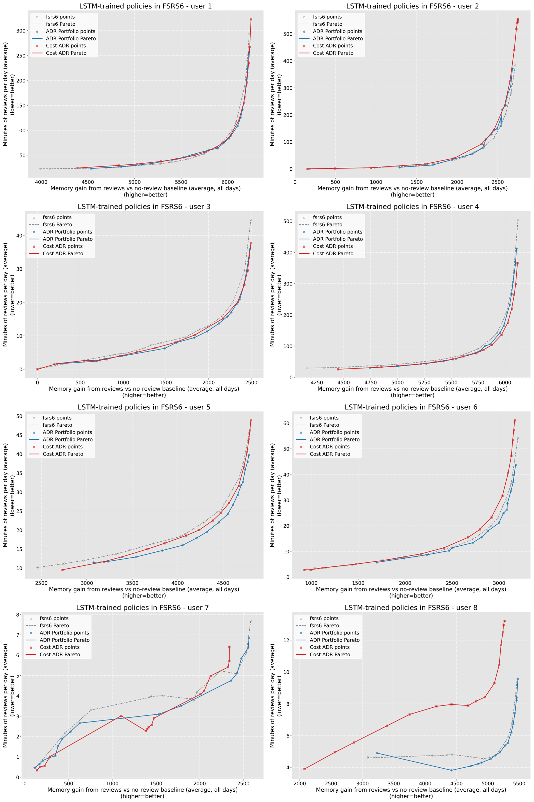
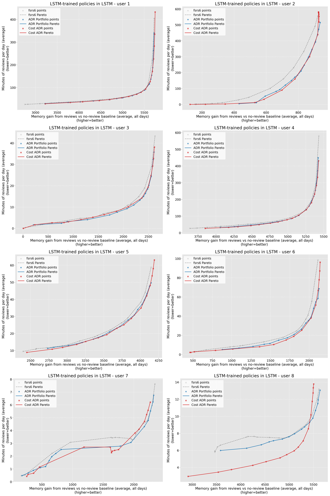

# LSTM-Trained Cost ADR vs ADR Portfolio, Users 1-128

Date: 2026-07-17

Analysis summaries:

- FSRS6: `artifacts/rl_scheduler/lstm_trained_cost_adr_adr_users_1_128_v1/fsrs6/analysis_review_gain.json`
- LSTM: `artifacts/rl_scheduler/lstm_trained_cost_adr_adr_users_1_128_v1/lstm/analysis_review_gain.json`

## Question

When Cost ADR and ordinary ADR Portfolio are trained directly against the LSTM
environment on users 1-128 with matched pop16/gen20 budgets, which scheduler is
better in LSTM, and how well do the resulting policies transfer back to FSRS6?

The primary Pareto axes are `review_memory_gain_average` and
`review_time_average`, so the comparison measures memory added by later reviews
against review-only time. Traditional `memorized_average` / `time_average`
results are retained as a sensitivity check.

## Executive Answer

Cost ADR wins the matched LSTM-native comparison.

In LSTM, Cost ADR adds 2,187,657 HV over FSRS6 versus 1,834,661 for ADR, a
Cost-minus-ADR advantage of +352,996 HV. Cost wins 92/128 users, has a positive
median per-user gap of +640 HV, adds 23.7 more cards of same-review-budget
memory-lift AUC, and saves 0.32 more minutes at the same memory target. Removing
user 59, whose Cost ADR training gate failed, increases the aggregate advantage
to +406,462 HV.

The LSTM-trained policies do not generalize well to FSRS6. ADR falls to -99,849
HV versus the FSRS6 baseline, while Cost ADR reaches only +87,690. Cost's
+187,539 aggregate advantage over ADR is not broad: it wins only 59/128 users,
has a negative median gap of -155 HV, and trails ADR by 58.6 cards of memory-lift
AUC and 0.95 minutes of time-saved AUC. User 111 alone contributes +199,496 HV
to the Cost-minus-ADR total because ADR transfers especially badly for that
user; removing that one user changes the aggregate gap to -11,958 HV.

Training on the target environment therefore resolves the previous LSTM
weakness of Cost ADR, but it does so through environment specialization rather
than a generally transferable policy. The 15-parameter Cost ADR head is the
stronger LSTM-native scheduler under this budget; neither LSTM-trained policy
is a replacement for an FSRS6-trained policy in FSRS6.

## Run

Evaluation run id: `lstm_trained_cost_adr_adr_users_1_128_v1`.

The run covers users 1-128, FSRS6 and LSTM environments, 1,825 days, a
10,000-card deck, learn limit 10, review limit 9,999, new-first priority,
short-term off, fuzz off, review Markov transition off, and evaluation seed 43.
Training uses seed 42 with generation-rotated simulation seeds.

Each user/environment has 48 fresh evaluation points:

| scheduler | points per user | source |
| --- | ---: | --- |
| FSRS6 | 16 | `artifacts/rl_scheduler/baseline_dr_selection/fsrs6_users_1_128_16dr_pop16_gen5.json` |
| ADR Portfolio | 16 | LSTM-trained SMS-EMOA portfolio |
| Cost ADR 15p | 16 | one LSTM-trained policy at 16 cost weights |

The two sweeps produced 12,288 JSONL logs. FSRS6 used one 6,144-lane batch;
LSTM used seven batches capped at 1,024 lanes.

## Training

| scheduler / phase | users | search | batches | elapsed | result |
| --- | ---: | --- | ---: | ---: | --- |
| ADR Portfolio | 1-128 | SMS-EMOA pop16, offspring16, gen20 | 2 | 1:06:28 | 128/128 passed; 2,048 policies validated |
| Cost ADR initial | 1-60 | CMA-ES pop16, gen20, 16 cost weights | 15 | 11:40:48 | 59 passed; user 59 gate failed; all 60 policies written |
| Cost ADR resume | 61-128 | same | 17 | 10:06:02 | 68/68 passed |
| Cost ADR combined | 1-128 | same | 32 | 21:46:50 | 128 valid policy artifacts evaluated |

User 59 completed all 20 generations. Its best training HV delta was -10,918,
so the overfit gate rejected it even though `policy.json`, `metadata.json`, and
`metrics.json` were valid. The runner stopped after that batch; users 61-128
were therefore run from the checked-in resume config. The user 59 policy remains
in the evaluation to avoid silently selecting only successful training users.

Configs:

- `experiments/rl_scheduler/configs/fsrs6_adr_lstm_train_portfolio_users_1_128_pop16_v1.toml`
- `experiments/rl_scheduler/configs/fsrs6_cost_adr_rethead_lstmtrain_intervalinit_wide_nopre_users_1_128_pop16_gen20_v1.toml`
- `experiments/rl_scheduler/configs/fsrs6_cost_adr_rethead_lstmtrain_intervalinit_wide_nopre_users_61_128_pop16_gen20_resume_v1.toml`

## Dynamic Pareto Results

HV delta is computed against each user's matched FSRS6 baseline frontier.
Memory lift integrates over the common review-time interval; time saved
integrates over the common review-memory-gain interval.

| env | scheduler | HV delta | HV / baseline | frontier points | memory-lift AUC | relative memory lift | budget span | time-saved AUC | relative time saved | target span |
| --- | --- | ---: | ---: | ---: | ---: | ---: | ---: | ---: | ---: | ---: |
| FSRS6 | ADR Portfolio | -99,849 | -0.305% | 1,945 | 34.0 | +1.347% | 74.729% | 0.98 | +4.400% | 81.768% |
| FSRS6 | Cost ADR 15p | 87,690 | +0.268% | 1,965 | -24.6 | -0.128% | 86.350% | 0.03 | -0.051% | 91.972% |
| FSRS6 | Cost - ADR | +187,539 | +0.573 pp | +20 | -58.6 | -1.475 pp | +11.621 pp | -0.95 | -4.452 pp | +10.205 pp |
| LSTM | ADR Portfolio | 1,834,661 | +4.920% | 2,039 | 87.1 | +3.034% | 74.680% | 6.48 | +14.318% | 82.362% |
| LSTM | Cost ADR 15p | 2,187,657 | +5.867% | 1,889 | 110.8 | +4.066% | 81.281% | 6.80 | +17.321% | 90.261% |
| LSTM | Cost - ADR | +352,996 | +0.947 pp | -150 | +23.7 | +1.031 pp | +6.601 pp | +0.32 | +3.004 pp | +7.899 pp |

Cost ADR has wider endpoint coverage in both environments. In LSTM, HV and
both interpolation AUCs agree that the additional coverage is useful. In FSRS6,
the aggregate HV result conflicts with the AUCs and per-user median; it should
not be read as robust transfer.

## Environment Specialization

The FSRS6-trained rows come from the earlier matched 128-user dynamic-baseline
run. The LSTM-trained rows are the new results.

| train env | eval env | ADR HV delta | Cost HV delta | Cost - ADR HV | ADR memory AUC | Cost memory AUC | ADR time AUC | Cost time AUC |
| --- | --- | ---: | ---: | ---: | ---: | ---: | ---: | ---: |
| FSRS6 | FSRS6 | 1,239,528 | 1,397,642 | +158,114 | 107.8 | 121.9 | 4.04 | 4.18 |
| FSRS6 | LSTM | 682,408 | 604,342 | -78,066 | 26.0 | 17.4 | 2.16 | 0.87 |
| LSTM | FSRS6 | -99,849 | 87,690 | +187,539 | 34.0 | -24.6 | 0.98 | 0.03 |
| LSTM | LSTM | 1,834,661 | 2,187,657 | +352,996 | 87.1 | 110.8 | 6.48 | 6.80 |

Relative to FSRS6 training, LSTM training raises LSTM HV by +1,152,253 for ADR
and +1,583,315 for Cost ADR. The same change lowers FSRS6 HV by -1,339,377 for
ADR and -1,309,952 for Cost ADR. This near-symmetric native gain and transfer
loss is strong evidence that environment mismatch, rather than insufficient
policy capacity alone, caused the previous LSTM result.

## Per-User Robustness

| env | Cost wins | ADR wins | median Cost - ADR HV | Cost below FSRS6 | ADR below FSRS6 |
| --- | ---: | ---: | ---: | ---: | ---: |
| FSRS6 | 59/128 | 69/128 | -155 | 52/128 | 36/128 |
| LSTM | 92/128 | 36/128 | +640 | 1/128 | 0/128 |

The only Cost ADR LSTM loss against the FSRS6 baseline is user 59, the same user
that failed the training gate. Its LSTM HV delta is -6,550 and its Cost-minus-ADR
gap is -53,466. Excluding it strengthens, rather than creates, the aggregate
Cost ADR result.

The FSRS6 aggregate Cost-minus-ADR gap is dominated by ADR's transfer failure on
user 111: ADR is -203,671 HV versus baseline while Cost is -4,175, producing a
+199,496 gap. Without user 111, aggregate Cost-minus-ADR HV is -11,958. This is
consistent with the 59/128 win count, negative median, and worse AUC values.

## Axis Sensitivity

| env | axes | Cost - ADR HV | Cost wins | median gap | memory-lift gap | time-saved gap |
| --- | --- | ---: | ---: | ---: | ---: | ---: |
| FSRS6 | review gain / review time | +187,539 | 59/128 | -155 | -58.6 | -0.95 |
| FSRS6 | total memory / total time | +206,917 | 61/128 | -89 | -58.7 | -0.96 |
| LSTM | review gain / review time | +352,996 | 92/128 | +640 | +23.7 | +0.32 |
| LSTM | total memory / total time | +402,883 | 101/128 | +970 | +23.4 | +0.32 |

Removing first-exposure memory and cost makes the LSTM Cost advantage more
conservative but does not reverse it. Both axis choices also reject robust
FSRS6 transfer.

## Counterfactual Checks

For every user/environment, all 48 points have the same rounded
`no_review_memorized_average`. Mean no-review memory is 5,143.2 cards in FSRS6
and 5,519.4 in LSTM, matching the earlier dynamic-baseline run.

There are three negative rounded review-gain points in FSRS6 and seven in LSTM.
All have zero rounded review time and range from -1 to -11 cards, so they are
finite-deck sampling and rounding around the expectation-based first-rating
baseline rather than evidence that substantive review schedules destroy
memory.

## Pareto Plots

Gray dashed lines are FSRS6, blue lines are ADR Portfolio, and red lines are
Cost ADR. The composites show users 1-8; all 128 per-user plots are under the
run artifact directory.

### FSRS6 Transfer

### LSTM Native

## GPU Monitor

Expandable CUDA allocator segments were enabled before CUDA initialization.
Every LSTM training and sweep stage used the 1,024-lane cap; FSRS6 evaluation
used 8,192.

| stage | elapsed | peak dedicated | peak summed shared | spill |
| --- | ---: | ---: | ---: | --- |
| ADR training, users 1-128 | 1:06:28 | 8,261 MiB | 216.9 MiB | false |
| Cost training, users 1-60 | 11:40:48 | 10,314 MiB | 485.2 MiB | false |
| Cost training, users 61-128 | 10:06:02 | 8,528 MiB | 321.7 MiB | false |
| FSRS6 evaluation | 2:05 | 10,612 MiB | 200.9 MiB | false |
| LSTM evaluation | 11:07 | 7,841 MiB | 198.2 MiB | false |

No stage approached the 1 GiB shared-memory spill threshold.

## Artifacts

- Raw logs: `logs/retention_sweep/lstm_trained_cost_adr_adr_users_1_128_v1`
- ADR training: `artifacts/rl_scheduler/fsrs6_adr_lstm_train_portfolio_users_1_128/fsrs6_adr_lstm_train_portfolio_users_1_128_pop16_v1`
- Cost training, users 1-60: `artifacts/rl_scheduler/fsrs6_cost_adr_rethead_lstmtrain_intervalinit_wide_nopre_users_1_128/fsrs6_cost_adr_rethead_lstmtrain_intervalinit_wide_nopre_users_1_128_pop16_gen20_v1`
- Cost training, users 61-128: `artifacts/rl_scheduler/fsrs6_cost_adr_rethead_lstmtrain_intervalinit_wide_nopre_users_61_128_resume/fsrs6_cost_adr_rethead_lstmtrain_intervalinit_wide_nopre_users_61_128_pop16_gen20_resume_v1`
- Combined Cost policy root: `artifacts/rl_scheduler/fsrs6_cost_adr_rethead_lstmtrain_intervalinit_wide_nopre_users_1_128_combined/policy_root`
- FSRS6 dynamic analysis: `artifacts/rl_scheduler/lstm_trained_cost_adr_adr_users_1_128_v1/fsrs6/analysis_review_gain.md`
- LSTM dynamic analysis: `artifacts/rl_scheduler/lstm_trained_cost_adr_adr_users_1_128_v1/lstm/analysis_review_gain.md`
- Training and evaluation source commit: `12f240c8f1fd6214ca1c327be93252b5f320555f`; experiment configs and this report were added after artifact generation.
